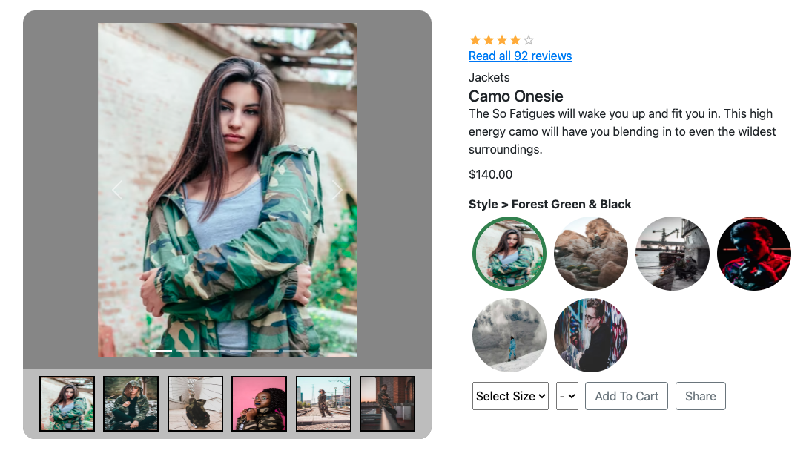
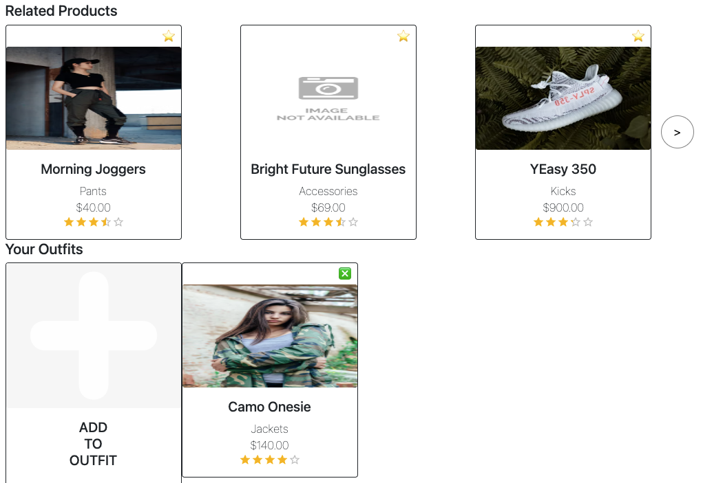
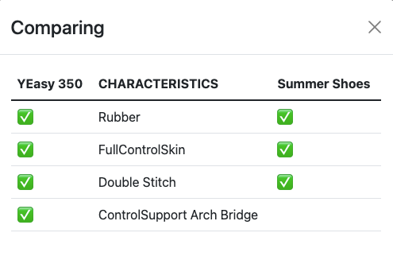
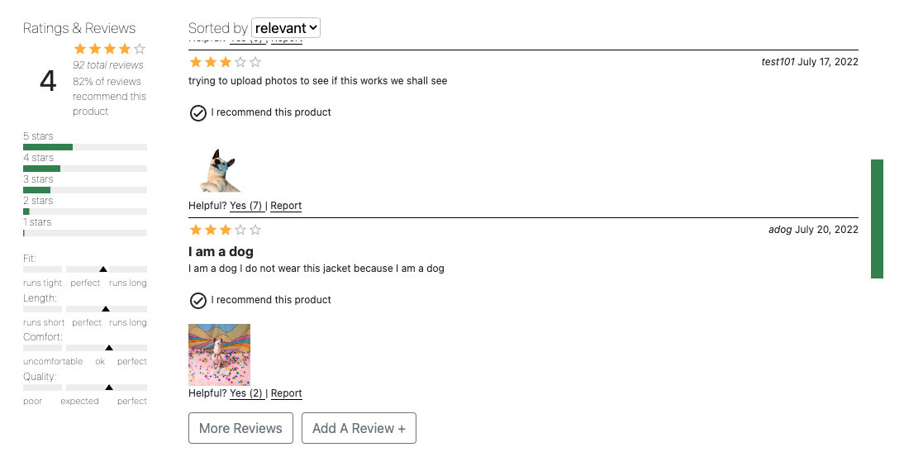
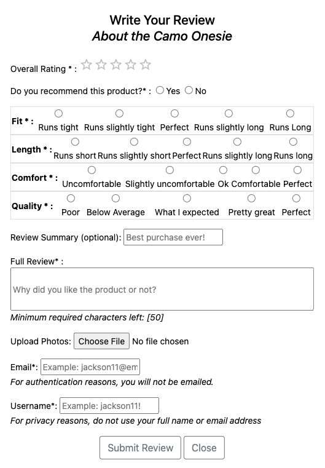

# rfc2205-atelier
Front End Capstone Project at Hack Reactor.

## Motivation

Project to deepen understanding of front-end development.

### Built With

* [React](https://reactjs.org/)
* [Node](https://nodejs.dev/)
* [Express](https://expressjs.com/)
* [Axios](https://axios-http.com/docs/api_intro)
* [Babel, Webpack](https://webpack.js.org/loaders/babel-loader/)
* [Jest, Webpack](https://jestjs.io/docs/webpack)
* [Bootstrap](https://react-bootstrap.github.io/)
* [MUI](https://mui.com/)
* [Cloudinary](https://cloudinary.com/)


## Component Details
### Main Product Overview

Product Overview displays a primary product with product information:
  - A gallery of product images
  - An assortment of styles to select for each product
  - Product descriptions, styles, and pricing
  - Size and quantity available

### Related Products and Your Outfits

Related Products displays a list of product cards showing items similar to the current product that may interest the user.
This component includes:
  - A carousel of related product cards that depict product information including: an image of the product, name of the product, product category, price, and rating.


  - A pop-up modal that shows a table comparing characteristics between the current product and the related product when the related product card is clicked.

Your Outfits allows users to save individual products based on their interest.
This component includes:
  - Add to Outfit card which adds the current product card to Your Outfits list
  - An option to remove the product card from the list if the user chooses


### Ratings & Reviews


Ratings and Reviews dynamically displays reviews and a breakdown of the metaData associated with a selected product
  - Ability to filter by star ratings and sort by newest, relevant, or helpful
  - Images in reviews can be clicked to open in a seperate modal to view a larger version
  - Can report reviews as helpful or report to block in future renders



Review submission form
  - Dynamically rendered characteristics ratings based on product details
  - Ability to upload images through Cloudinary

## Installation


To get a local copy up and running follow these simple steps:
###### Pre-Installation Requirements
    Node v16.14.2
    NPM 8.5.0
###### Instructions
1. Clone the repo
   ```sh
   git clone https://github.com/RFC2205-FEC-Ganymede/rfc2205-atelier.git
   ```
2. Acquire a github personal access token to acquire access to the API. Insert token into example.env and rename file to .env
3. Install NPM packages
   ```sh
   npm install
    ```
3. Compile Webpack
   ```sh
   npm run build
    ```
4. Start the server
   ```sh
   npm run start
    ```
5. Navigate to localhost:3000

## Team

* Dylan Hollier - Product Overview
  * https://github.com/Dylanph21
  * https://www.linkedin.com/in/dylan-hollier-b4a56321a/

* Jean Kim - Rating and Reviews
  * https://github.com/jeankayy
  * https://www.linkedin.com/in/jeankim1/

* Shirley Nguyen - Related Products
  * https://github.com/shnguyen8
  * https://www.linkedin.com/in/shirley-h-nguyen/

